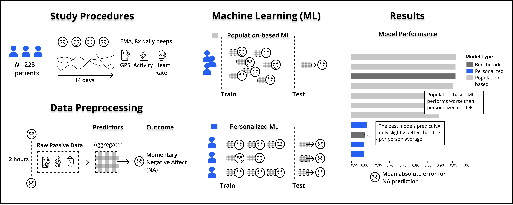

# PREACT-digital

This repository contains the codebase for the **PREACT-digital** project, associated with the paper:

> **Towards JITAI – Moment-to-moment Prediction of Negative Affect in Internalizing Disorders using Digital Phenotyping**

  

## Repository Structure

- **model_pipeline/**  
  Contains all model definitions, training scripts, and evaluation code related to the predictive modeling of negative affect.

- **src/**  
  Houses preprocessing functions and utilities required to transform raw data into a format suitable for model training and evaluation.

- **relevant notebooks/**
  - **X1_Short_Term_Prediction.ipynb**  
    - Notebook for running the model pipeline and create plots. It utilizes modules in `model_pipeline/` and processes the output from the preprocessing step.
  - **03_JITAI_Preprocess.ipynb**  
    - Notebook for executing data preprocessing steps, aligning EMA with passive data and aggregating them. It relies on functions from `src/` to clean and prepare raw data.
  - **01_Data_Preprocess.ipynb**  
    - Notebook for basic data preprocessing, including concatenation of EMA and passive data with study monitoring data, and timestamp alignement.

